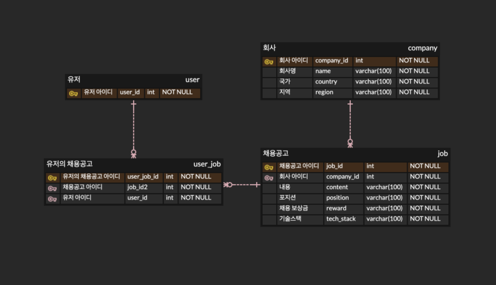

# 원티드 | 백엔드 프리온보딩 인터십 사전과제
<!-- toc -->
- [원티드 | 백엔드 프리온보딩 인터십 사전과제](#원티드--백엔드-프리온보딩-인터십-사전과제)
  - [지원자 성명](#지원자-성명)
  - [기술스택](#기술스택)
    - [Backend :   ](#backend----)
    - [Database : ](#database--)
  - [데이터베이스 테이블 구조](#데이터베이스-테이블-구조)
  - [구현 방법 및 이유에 대한 간략한 설명](#구현-방법-및-이유에-대한-간략한-설명)
  - [API 명세 (request/response 포함)](#api-명세-requestresponse-포함)
  - [테스트코드 유형](#테스트코드-유형)

<!-- tocstop -->
## 지원자 성명
사재혁
## 기술스택
### Backend :   
### Database : 
## 데이터베이스 테이블 구조

## 구현 방법 및 이유에 대한 간략한 설명
- 채용공고를 등록합니다.
  - company_id를 매개변수로 받아 존재하는 회사인지 확인합니다.
  - content, position, reward, tech_stack 필드를 입력받습니다.
  - 존재하는 회사라면 채용공고를 등록합니다.
  - 존재하지 않는 회사라면 채용공고를 등록하지 않습니다.
- 채용공고를 수정합니다.
  - job_id를 매개변수로 받아 존재하는 채용공고인지 확인합니다.
  - content, position, reward, tech_stack 필드를 입력받습니다.
  - 존재하는 채용공고라면 채용공고를 수정합니다.
  - 존재하지 않는 채용공고라면 채용공고를 수정하지 않습니다.
- 채용공고를 삭제합니다.
  - job_id를 매개변수로 받아 존재하는 채용공고인지 확인합니다.
  - 존재하는 채용공고라면 채용공고를 삭제합니다.
  - 존재하지 않는 채용공고라면 채용공고를 삭제하지 않습니다.
- 채용공고 목록을 가져옵니다 & 채용공고 검색 기능 구현(선택사항 및 가산점요소)
  - search 매개변수를 받아 채용공고를 검색합니다.
  - search가 빈 문자열이라면 채용공고 전체 목록을 가져옵니다.
  - 채용공고가 존재한다면 채용공고 목록을 가져옵니다.
  - 채용공고가 존재하지 않는다면 채용공고 목록을 가져오지 않습니다.
- 채용 상세 페이지를 가져옵니다.
  - job_id를 매개변수로 받아 존재하는 채용공고인지 확인합니다.
  - 존재하는 채용공고라면 채용공고 상세 페이지를 가져옵니다.
  - 존재하지 않는 채용공고라면 채용공고 상세 페이지를 가져오지 않습니다.
  - 채용공고 상세 페이지에 회사의 다른 채용공고를 가져옵니다.
- 사용자는 채용공고에 지원합니다(선택사항 및 가산점요소).
  - user_id와 job_id를 매개변수로 받아 존재하는 사용자와 채용공고인지 확인합니다.
  - 존재하는 사용자와 채용공고라면 채용공고에 지원합니다.
  - 존재하지 않는 사용자와 채용공고라면 채용공고에 지원하지 않습니다.
  - 이미 채용공고에 지원한 사용자라면 채용공고에 지원하지 않습니다.

## API 명세 (request/response 포함)
|Action| Method| URL|**Request**|Response|
|-----|----|----|----|----|
|채용공고 등록| POST| /api/v1/jobs/\<int:company_id\>/|content, position, reward, tech_stack|company_id, position, reward, tech_stack, content
|채용공고 수정| PUT| /api/v1/jobs/details/\<int:job_id\>/|content, position, reward, tech_stack|position, reward, tech_stack, content
|채용공고 삭제| DELETE| /api/v1/jobs/details/\<int:job_id\>/||
|채용공고 목록 조회 및 검색| GET| /api/v1/jobs/?search= ||job_id, position, reward, tech_stack, content, company_name, company_country, company_region
|채용공고 상세 조회 | GET| /api/v1/jobs/details/\<int:job_id\>/||job_id, position, reward, tech_stack, content, company_name, company_country, company_region, company_related_job
|사용자 채용공고 지원|POST| /api/v1/jobs/recruit/\<int:job_id\>/users/\<int:user_id\>/||user_id, job_id

## 테스트코드 유형
- 채용공고 리스트 테스트
  - 채용공고 리스트 조회 성공
  - 채용공고 리스트 조회 실패
  - 채용공고 리스트 검색 조회 성공
  - 채용공고 리스트 검색 조회 실패
    - 채용공고 존재 유무

- 채용공고 생성 테스트
  - 채용공고 생성 성공
  - 채용공고 생성 실패
    - 회사 존재 유무
    - 필드값 빈캆 유무
    - 필드캆 존재 유무

- 체용공고 상세 조회 테스트
  - 채용공고 상세 조회 성공
  - 채용공고 상세 조회 실패
    - 채용공고 존재 유무

- 채용공고 수정 테스트
  - 채용공고 수정 성공
  - 채용공고 수정 실패
    - 채용공고 존재 유무
    - 필드값 빈캆 유무
    - 필드캆 존재 유무

- 채용공고 삭제 테스트
  - 채용공고 삭제 성공
  - 채용공고 삭제 실패
    - 채용공고 존재 유무

- 채용공고 지원 테스트
  - 채용공고 지원 성공
  - 채용공고 지원 실패
    - 채용공고 존재 유무
    - 지원자 존재 유무
    - 지원자 이미 채용공고 지원 유무
